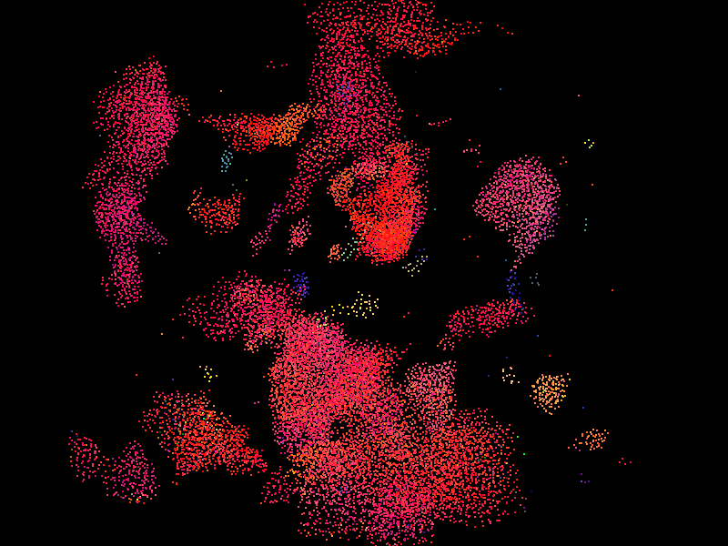
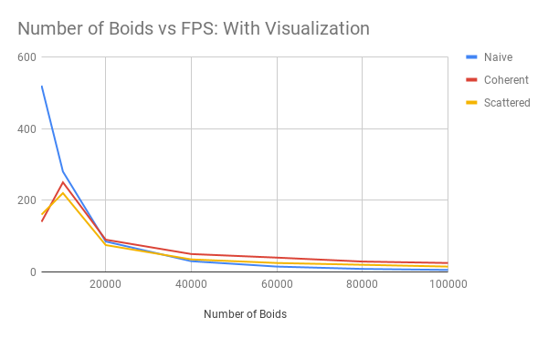
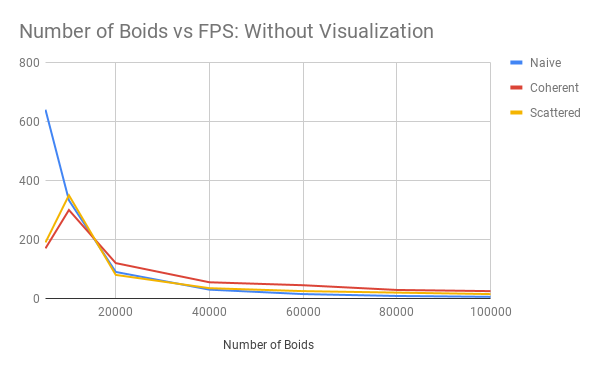
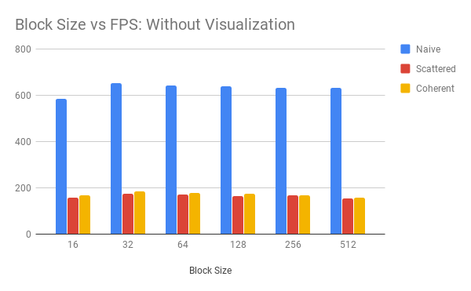

**University of Pennsylvania, CIS 565: GPU Programming and Architecture,
Project 1 - Flocking**

* Eric Chiu
* Tested on: Windows 10 Education, Intel(R) Xeon(R) CPU E5-1630 v4 @ 3.60GHz 32GB, NVIDIA GeForce GTX 1070 (SIGLAB)

## Result

## Performance Analysis

